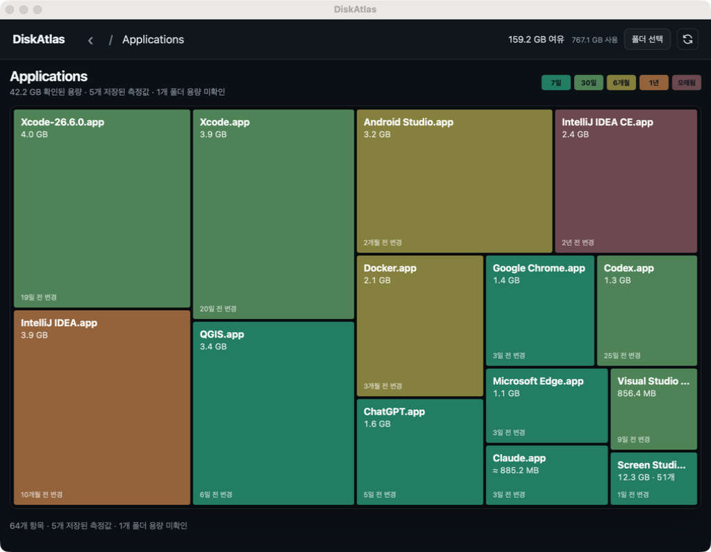

# DiskAtlas

**Find what's using your disk. Review cleanup candidates before you act.**

DiskAtlas is a desktop disk-usage explorer for macOS and Windows. It maps folders by size, surfaces large files and common cleanup candidates, and explains why each item was flagged.



## Install

### macOS

Install with Homebrew:

```sh
brew install --cask sangwonl/tap/diskatlas
```

You can also download the universal macOS app from [GitHub Releases](https://github.com/sangwonl/diskatlas/releases/latest).

macOS may ask for access the first time DiskAtlas reads protected locations such as Desktop, Documents, Downloads, external drives, or network volumes. Full Disk Access has no automatic permission popup; grant it in **System Settings → Privacy & Security → Full Disk Access** if you want DiskAtlas to inspect protected system locations.

### Windows

When a Windows build is included in a release:

1. Download `DiskAtlas-amd64-installer.exe` from [GitHub Releases](https://github.com/sangwonl/diskatlas/releases/latest).
2. Run the installer. It installs DiskAtlas for your Windows user account.
3. If Microsoft Defender SmartScreen warns that the app is unrecognized, first confirm the installer came from the official GitHub Releases page. For an unsigned build, select **More info → Run anyway** to continue.

Windows releases are x64. Without a code-signing certificate, the installer is unsigned and may trigger SmartScreen.

## What it does

- Maps disk usage so you can explore from large folders down to individual files.
- Finds large files, development caches, application data, and other cleanup candidates.
- Labels candidates as **safe**, **caution**, **review**, or **protected**, with an explanation and rebuild guidance.
- Lets you filter by size, age, and category, and reveal an item's location before taking action.
- Tracks filesystem changes so later refreshes can update affected areas without always repeating a full scan.

DiskAtlas scans the configured locations on your computer. It does not follow symbolic links. Some usage may be unclassified, and shared filesystem blocks can make reported sizes differ from the space reclaimed after cleanup.

## Safety

- Scanning does not modify files. System, credential, and application paths are protected from cleanup.
- Personal files and Git-tracked data are marked for review; size or age alone does not mean a file is safe to remove.
- The desktop app shows a review dialog and requires a press-and-hold confirmation for cleanup actions. It rechecks each path before acting.
- The CLI defaults to a dry run. Its quarantine option moves eligible files into recoverable storage and supports restoring the last batch.

## Command-line tools

The source includes a dependency-free Node.js CLI (Node.js 22 or newer). From the repository root:

```sh
node bin/diskatlas.mjs scan ~/Projects
node bin/diskatlas.mjs report --tier safe
node bin/diskatlas.mjs plan
node bin/diskatlas.mjs clean                 # preview only
node bin/diskatlas.mjs clean --quarantine --yes
node bin/diskatlas.mjs restore --last
```

Scan results and history are stored in the `.shed` directory under the current working directory. To open the browser interface locally, run `npm run gui`; it serves on `http://127.0.0.1:4173`.

## Build from source

The native app uses Go 1.25, Wails v2, and Node.js 22. With the Wails CLI installed:

```sh
npm run wails:dev
npm run wails:build
```

See [release build instructions](scripts/release/README.md) for platform packaging, signing, and notarization.
